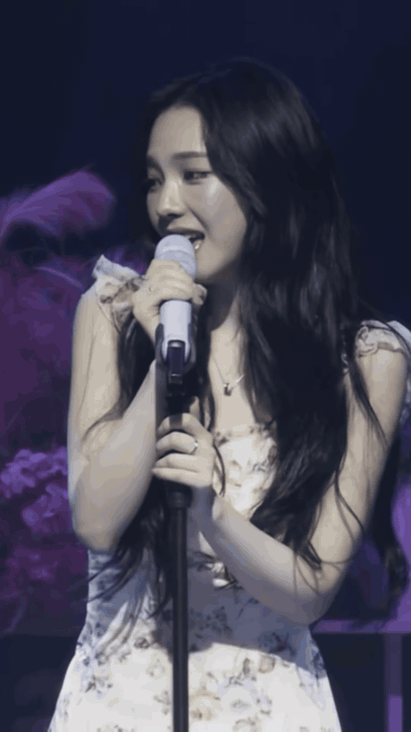

<!-- 顶部霓虹渐变波浪 -->

<!-- 打字机 -->

 

 

<!-- ✧･ﾟ:* My Bias *:･ﾟ✧ -->

 

 

> *"네 안에 내가 있어 — I'm in your universe"*  
> — **KARINA**, aespa

 

 

<!-- Stats -->

 

 

  

 

<!-- Snake -->

 

<picture>
  <source media="(prefers-color-scheme: dark)" srcset="https://raw.githubusercontent.com/xuyanging/xuyanging/output/github-snake-dark.svg" />
  
</picture>

 

<!-- 底部 -->

✦ <em>「 forever MY, 으아아 KARINA 」</em> ✦

